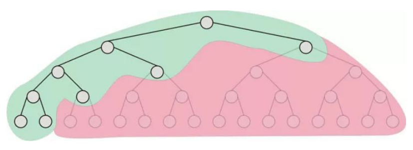

# 电力系统网损优化

1. 输入输出

   输入：一个电力系统的潮流参数和线路本身的参数

* 节点数：N，节点的负载情况和发电机分布情况（确定节点的类型PV还是PQ还是平衡）
* 线路数：M，线路电路参数
* 节点或者线路能够进行的操作列表
* 已经计算好的线路瞬时潮流（计算网损） 

输出：应该在何处采取何种电力操作

* 220KV线路上的串联电容还是电感

通过改变线路的电路参数重新计算一次网损

* 线路改变并列方式（双线单线的切换）

  也是线路的电路参数

* 变压器的并列方式

  修改变压器模型中的电路参数 X

* 母线上的并联电容或者电抗器

* 同步调相机改变节点相位

* 同步调相机

  电力系统中的主要负载是异步电动机和变压器，需要从电网汲取大量的无功，在负载过大的时候，会造成电网的功率因数下降，造成线路的损耗上升。所以可以在受电端投入发出无功的同步调相机，这能够改善系统的功率因数，使得系统传输的无功减少，进而降低网损。

  比如在电网重载运行的时候，让调相机运行在过励的状态，可以增加电网中的滞后电流。

* 调节发电机的无功出力

  数字控制的自动励磁系统，通过控制励磁电流改变发电机的无功。建立负反馈的传递函数。

* 改变变压器的变比

  12.3节电力系统课本关于利用无功功率补偿调压

2. 电网拓扑分割

3. 程序模型

* 线路模型 Line：每条线路的网损，计算接口：

  `calcLineLoss();`

* 节点模型 Bus：每个节点的历史电价，平均值作为实时电价，作为网损代价的一部分

  计算接口：`updatePrice();`

* 变压器模型 Transformer：变压器的台数（并联运行的模式），

  计算接口：`calcTansformerLoss();`

* 总体网架结构 `grid_220`: 包括上面的三个对象模型，然后包含一些计算的接口。

  `calcPowerFlowLoss()`	

  `lossJudge();`  // 查看网络中网损情况最严重，优先等级较高的区域进行处理

4. 如何按照已经得到的数据建立优化的模型

   * 约束条件

     1. 电力系统的等式平衡
        $$
        P_i = V_i \sum_{j\in h} V_j(G_{ij}cos\delta_{ij}+B_{ij}sin\delta_{ij})\\
        Q_i = V_i \sum_{j\in h} V_j(G_{ij}cos\delta_{ij}-B_{ij}sin\delta_{ij})
        $$

     2. 电力系统的不等式平衡
        $$
        V_{gmin} \leq V_{gi} \leq V_{gmax}\\
        Q_{cmin} \leq Q_{ci} \leq Q_{cmax}\\
        T_{imin} \leq T_{i} \leq T_{imax}\\
        $$

     3. 目标函数
        $$
        F = min [\omega_1 P_{\Delta} + \omega_2 \sum_{i=1}^{N}(\frac{\Delta V_i} {V_{imax}-V_{imin}}) ^ 2 + \omega_3 \sum_{i=1}^{N} (\Delta Q_i)^2]
        $$
        第一项考虑网损值，第二项考虑了超过节点电压超过额定值的罚项，第三项考虑了无功超过界限的罚项。

        比如有投切的电抗电容器的组数，变压器分接头的挡数，实际发电机机端电压，等等。

        1. 电力系统拓扑调整方法

        * 并联电容电抗器

          把有并联电容电抗的节点处看做PV节点，最后优化算出的无功值可以转化为具体的电抗电容值。

          或者让有并联电容电抗器的节点的参数$G_{ij}$ 和 $B_{ij}$  作为变量参与优化。
          $$
          F = min [\omega_1 P_{\Delta} + \omega_2 \sum_{i=1}^{N}(\frac{\Delta V_i} {V_{imax}-V_{imin}}) ^ 2 + \omega_3 \sum_{i=1}^{N} (\Delta Q_i)^2]\\
          s.t.P_i = V_i \sum_{j\in h} V_j(G_{ij}cos\delta_{ij}+B_{ij}sin\delta_{ij})\\
          Q_i = V_i \sum_{j\in h} V_j(G_{ij}cos\delta_{ij}-B_{ij}sin\delta_{ij})\\
          V_{gmin} \leq V_{gi} \leq V_{gmax}\\
          Q_{cmin} \leq Q_{ci} \leq Q_{cmax}\\
          N_{min} \leq N \leq N_{max} // 可以增加减少的阻抗值的限制值
          $$

        * 线路改变并列方式

          改变对应线路的物理参数值，作为控制变量进行优化。（不过是整数规划）混合整数规划
          $$
          F = min [\omega_1 P_{\Delta} + \omega_2 \sum_{i=1}^{N}(\frac{\Delta V_i} {V_{imax}-V_{imin}}) ^ 2 + \omega_3 \sum_{i=1}^{N} (\Delta Q_i)^2]\\
          s.t.P_i = V_i \sum_{j\in h} V_j(G_{ij}cos\delta_{ij}+B_{ij}sin\delta_{ij})\\
          Q_i = V_i \sum_{j\in h} V_j(G_{ij}cos\delta_{ij}-B_{ij}sin\delta_{ij})\\
          V_{gmin} \leq V_{gi} \leq V_{gmax}\\
          Q_{cmin} \leq Q_{ci} \leq Q_{cmax}\\
          // 如何表示可行集？
          $$

        * 修改变压器的并列方式

          改变对应线路的物理参数值，作为控制变量进行优化。（不过是整数规划）

        * 改变变压器的变比

          利用混合整数规划
          $$
          目标函数 \; F = min [\omega_1 P_{\Delta} + \omega_2 \sum_{i=1}^{N}(\frac{\Delta V_i} {V_{imax}-V_{imin}}) ^ 2 + \omega_3 \sum_{i=1}^{N} (\Delta Q_i)^2]\\
          $$
          对于每一个节点，可以列出下面的方程
          $$
          S_{i}=e_{i}^{*} U I^{*} e_{i}=e_{i}^{*} U U^{*} Y^{*} e_{i}= \\
          \operatorname{tr}\left(\boldsymbol{U} \boldsymbol{U}^{*}\left(\boldsymbol{Y}^{*} \boldsymbol{e}_{i} \boldsymbol{e}_{i}^{*}\right)\right)=\boldsymbol{U}^{*} \boldsymbol{Y}_{i}^{*} \boldsymbol{U}=\\
          \boldsymbol{U}^{*} \frac{\boldsymbol{Y}_{i}^{*}+\boldsymbol{Y}_{i}}{2} \boldsymbol{U}+\mathrm{j}\left(\boldsymbol{U}^{*} \frac{\boldsymbol{Y}_{i}^{*}-\boldsymbol{Y}_{i}}{2 j} \boldsymbol{U}\right)\\
          S_i 为 节 点 i 的 注 入 功 率;\\
          e_i 为 第 i 个 元 素 为 1, 其他元素全 为 0 的 列 向 量;\\
          U 和 I 分 别 为 电 压 列向量 和 电 流 列 向 量;\\
          Y 为 系 统 节 点 导 纳 矩 阵\\
          Y_i = e_i e_i^* Y
          $$
          为了方便表示，可以利用下面的表示方式： $\Phi_{i}=\left(\boldsymbol{Y}_{i}^{*}+\boldsymbol{Y}_{i}\right) / 2$， $\boldsymbol{\Psi}_{i}=\left(\boldsymbol{Y}_{i}^{*}-\boldsymbol{Y}_{i}\right) / 2$ 。并且对于功率的有功和无功部分分开讨论。
          $$
          \left\{\begin{array}{l}
          {P_{i}=P_{i, \mathrm{DG}}-P_{i, d}=\boldsymbol{U}^{*} \boldsymbol{\Phi}_{i} \boldsymbol{U}} \\ {Q_{i}=Q_{i, \mathrm{pG}}+k_{i} q_{i, \mathrm{CP}}-Q_{i, \mathrm{d}}=\boldsymbol{U}^{*} \boldsymbol{\Psi}_{i} \boldsymbol{U}}
          \end{array}\right.\\
          其中P_i 是节点 i 的注入有功功率，Q_i 是节点 i 的注入无功功率\\
          Q_{i, \mathrm{pG}} 是节点 i 上连接的DG无功功率，k_i 是投切的容抗装置的档位，\\
          q_{i, \mathrm{CP}} 是单位档位的补偿功率
          $$

          接下来就是如何把目标函数中的网损表示为各个节点电压的函数了。

          对于负荷功率有假设如下：

          - 负荷恒功率
          - 负荷恒阻抗

          则有
          $$
          \left
          \{\begin{array}{c}
          {P_{i . \mathrm{d}}=P_{i, 0}\left[a_{i, P}\left(\frac{V_{i}}{V_{i, 0}}\right)^{2}+b_{i, P}\right]=b_{i, P} P_{i, 0}+} \\ {\boldsymbol{U}^{*} \boldsymbol{\Phi}_{i}^{*} \boldsymbol{U}} \\ {Q_{i . \mathrm{d}}=Q_{i, 0}\left[a_{i, Q}\left(\frac{V_{i}}{V_{i, 0}}\right)^{2}+b_{i, Q}\right]=b_{i, Q} Q_{i, 0}+} \\ {\boldsymbol{U}^{*} \boldsymbol{\Psi}_{i}^{*} \boldsymbol{U}}\end
          {array}
          \right.\\
          其中a_{i,P}和 b_{i,P}是恒阻抗有功负荷占总有功负荷的比例\\
          其中a_{i,Q}和 b_{i,Q}是恒阻抗无功负荷占总无功负荷的比例
          $$
          网损可以表示为下面的式子
          $$
          \begin{aligned} 
          \Delta P = \sum_{i=1}^{n} P_{i}-\sum_{i=1}^{n} P_{i, \mathrm{d}} &=\sum_{i=1}^{n} \boldsymbol{U}^{*} \boldsymbol{\Phi}_{i} \boldsymbol{U}-\sum_{i=1}^{n} \boldsymbol{U}^{*} \boldsymbol{\Phi}_{i}^{*} \boldsymbol{U}-\\ \sum_{i=1}^{n} b_{i, P} P_{i, 0} &=\boldsymbol{U}^{*}\left(\frac{\boldsymbol{Y}^{*}+\boldsymbol{Y}}{2}-\boldsymbol{\Phi}^{*}\right) \boldsymbol{U}-\\ \sum_{i=1}^{n} b_{i, P} P_{i, 0} &=\operatorname{tr}\left(\boldsymbol{M} \boldsymbol{U} \boldsymbol{U}^{*}\right)-\sum_{i=1}^{n} b_{i, P} P_{i, 0} 
          \end{aligned}\\
          其中\; \Phi^{*}=\sum_{i=1}^{n} \Phi_{i}^{*} ; M=\left(Y^{*}+Y\right) / 2-\Phi^{*}
          $$
          电压和有功，无功的约束可以表示为下面的形式
          $$
          {\min _{\boldsymbol{U}} \operatorname{tr}\left(\boldsymbol{M U U}^{*}\right)} \\ {\text { s.t. } \operatorname{tr}\left(\left(\boldsymbol{\Phi}_{i}+\boldsymbol{\Phi}_{i}^{*}\right) \boldsymbol{U} \boldsymbol{U}^{*}\right)=P_{i}^{\prime}} \\ {\underline{Q}_{i} \leqslant \operatorname{tr}\left(\left(\boldsymbol{\Psi}_{i}+\boldsymbol{\Psi}_{i}^{*}\right) \boldsymbol{U} \boldsymbol{U}^{*}\right) \leqslant \overline{Q}_{i}} \\ {\underline{V}_{i}^{2} \leqslant \operatorname{tr}\left(\boldsymbol{e}_{i} \boldsymbol{e}_{i}^{*} \boldsymbol{U} \boldsymbol{U}^{*}\right) \leqslant \overline{V}_{i}^{2}}
          $$
          要加上通过并联容抗器的方式进行调节无功的话，只需要在约束中加上一个离散的变量即可
          $$
          {\min _{\boldsymbol{U}} \operatorname{tr}\left(\boldsymbol{M U U}^{*}\right)} \\ 
          {\text { s.t. } 
          \operatorname{tr}\left(\left(\boldsymbol{\Phi}_{i}+\boldsymbol{\Phi}_{i}^{*}\right) \boldsymbol{U} \boldsymbol{U}^{*}\right)=P_{i}^{\prime}} \\ 
          {\underline{Q}_{i} \leqslant \operatorname{tr}\left(\left(\boldsymbol{\Psi}_{i}+\boldsymbol{\Psi}_{i}^{*}\right) \boldsymbol{U} \boldsymbol{U}^{*}\right) - k_iq_{i,CP} \leqslant \overline{Q}_{i}} \\ {\underline{V}_{i}^{2} \leqslant \operatorname{tr}\left(\boldsymbol{e}_{i} \boldsymbol{e}_{i}^{*} \boldsymbol{U} \boldsymbol{U}^{*}\right) \leqslant \overline{V}_{i}^{2}}
          $$

        * 投切母线并联容抗器

          利用混合整数规划
          $$
          目标函数 \; F = min [\omega_1 P_{\Delta} + \omega_2 \sum_{i=1}^{N}(\frac{\Delta V_i} {V_{imax}-V_{imin}}) ^ 2 + \omega_3 \sum_{i=1}^{N} (\Delta Q_i)^2]\\
          $$
          对于每一个节点，可以列出下面的方程
          $$
          S_{i}=e_{i}^{*} U I^{*} e_{i}=e_{i}^{*} U U^{*} Y^{*} e_{i}= \\
          \operatorname{tr}\left(\boldsymbol{U} \boldsymbol{U}^{*}\left(\boldsymbol{Y}^{*} \boldsymbol{e}_{i} \boldsymbol{e}_{i}^{*}\right)\right)=\boldsymbol{U}^{*} \boldsymbol{Y}_{i}^{*} \boldsymbol{U}=\\
          \boldsymbol{U}^{*} \frac{\boldsymbol{Y}_{i}^{*}+\boldsymbol{Y}_{i}}{2} \boldsymbol{U}+\mathrm{j}\left(\boldsymbol{U}^{*} \frac{\boldsymbol{Y}_{i}^{*}-\boldsymbol{Y}_{i}}{2 j} \boldsymbol{U}\right)\\
          S_i 为 节 点 i 的 注 入 功 率;\\
          e_i 为 第 i 个 元 素 为 1, 其他元素全 为 0 的 列 向 量;\\
          U 和 I 分 别 为 电 压 列向量 和 电 流 列 向 量;\\
          Y 为 系 统 节 点 导 纳 矩 阵\\
          Y_i = e_i e_i^* Y
          $$
          为了方便表示，可以利用下面的表示方式： $\Phi_{i}=\left(\boldsymbol{Y}_{i}^{*}+\boldsymbol{Y}_{i}\right) / 2$， $\boldsymbol{\Psi}_{i}=\left(\boldsymbol{Y}_{i}^{*}-\boldsymbol{Y}_{i}\right) / 2$ 。并且对于功率的有功和无功部分分开讨论。
          $$
          \left\{\begin{array}{l}
          {P_{i}=P_{i, \mathrm{DG}}-P_{i, d}=\boldsymbol{U}^{*} \boldsymbol{\Phi}_{i} \boldsymbol{U}} \\ {Q_{i}=Q_{i, \mathrm{pG}}+k_{i} q_{i, \mathrm{CP}}-Q_{i, \mathrm{d}}=\boldsymbol{U}^{*} \boldsymbol{\Psi}_{i} \boldsymbol{U}}
          \end{array}\right.\\
          其中P_i 是节点 i 的注入有功功率，Q_i 是节点 i 的注入无功功率\\
          Q_{i, \mathrm{pG}} 是节点 i 上连接的DG无功功率，k_i 是投切的容抗装置的档位，\\
          q_{i, \mathrm{CP}} 是单位档位的补偿功率
          $$
          接下来就是如何把目标函数中的网损表示为各个节点电压的函数了。

          对于负荷功率有假设如下：

          * 负荷恒功率
          * 负荷恒阻抗

          则有
          $$
          \left
          \{\begin{array}{c}
          {P_{i . \mathrm{d}}=P_{i, 0}\left[a_{i, P}\left(\frac{V_{i}}{V_{i, 0}}\right)^{2}+b_{i, P}\right]=b_{i, P} P_{i, 0}+} \\ {\boldsymbol{U}^{*} \boldsymbol{\Phi}_{i}^{*} \boldsymbol{U}} \\ {Q_{i . \mathrm{d}}=Q_{i, 0}\left[a_{i, Q}\left(\frac{V_{i}}{V_{i, 0}}\right)^{2}+b_{i, Q}\right]=b_{i, Q} Q_{i, 0}+} \\ {\boldsymbol{U}^{*} \boldsymbol{\Psi}_{i}^{*} \boldsymbol{U}}\end
          {array}
          \right.\\
          其中a_{i,P}和 b_{i,P}是恒阻抗有功负荷占总有功负荷的比例\\
          其中a_{i,Q}和 b_{i,Q}是恒阻抗无功负荷占总无功负荷的比例
          $$
          网损可以表示为下面的式子
          $$
          \begin{aligned} 
          \Delta P = \sum_{i=1}^{n} P_{i}-\sum_{i=1}^{n} P_{i, \mathrm{d}} &=\sum_{i=1}^{n} \boldsymbol{U}^{*} \boldsymbol{\Phi}_{i} \boldsymbol{U}-\sum_{i=1}^{n} \boldsymbol{U}^{*} \boldsymbol{\Phi}_{i}^{*} \boldsymbol{U}-\\ \sum_{i=1}^{n} b_{i, P} P_{i, 0} &=\boldsymbol{U}^{*}\left(\frac{\boldsymbol{Y}^{*}+\boldsymbol{Y}}{2}-\boldsymbol{\Phi}^{*}\right) \boldsymbol{U}-\\ \sum_{i=1}^{n} b_{i, P} P_{i, 0} &=\operatorname{tr}\left(\boldsymbol{M} \boldsymbol{U} \boldsymbol{U}^{*}\right)-\sum_{i=1}^{n} b_{i, P} P_{i, 0} 
          \end{aligned}\\
          其中\; \Phi^{*}=\sum_{i=1}^{n} \Phi_{i}^{*} ; M=\left(Y^{*}+Y\right) / 2-\Phi^{*}
          $$
          电压和有功，无功的约束可以表示为下面的形式
          $$
          {\min _{\boldsymbol{U}} \operatorname{tr}\left(\boldsymbol{M U U}^{*}\right)} \\ {\text { s.t. } \operatorname{tr}\left(\left(\boldsymbol{\Phi}_{i}+\boldsymbol{\Phi}_{i}^{*}\right) \boldsymbol{U} \boldsymbol{U}^{*}\right)=P_{i}^{\prime}} \\ {\underline{Q}_{i} \leqslant \operatorname{tr}\left(\left(\boldsymbol{\Psi}_{i}+\boldsymbol{\Psi}_{i}^{*}\right) \boldsymbol{U} \boldsymbol{U}^{*}\right) \leqslant \overline{Q}_{i}} \\ {\underline{V}_{i}^{2} \leqslant \operatorname{tr}\left(\boldsymbol{e}_{i} \boldsymbol{e}_{i}^{*} \boldsymbol{U} \boldsymbol{U}^{*}\right) \leqslant \overline{V}_{i}^{2}}
          $$
          要加上通过并联容抗器的方式进行调节无功的话，只需要在约束中加上一个离散的变量即可
          $$
          {\min _{\boldsymbol{U}} \operatorname{tr}\left(\boldsymbol{M U U}^{*}\right)} \\ 
          {\text { s.t. } 
          \operatorname{tr}\left(\left(\boldsymbol{\Phi}_{i}+\boldsymbol{\Phi}_{i}^{*}\right) \boldsymbol{U} \boldsymbol{U}^{*}\right)=P_{i}^{\prime}} \\ 
          {\underline{Q}_{i} \leqslant \operatorname{tr}\left(\left(\boldsymbol{\Psi}_{i}+\boldsymbol{\Psi}_{i}^{*}\right) \boldsymbol{U} \boldsymbol{U}^{*}\right) - k_iq_{i,CP} \leqslant \overline{Q}_{i}} \\ {\underline{V}_{i}^{2} \leqslant \operatorname{tr}\left(\boldsymbol{e}_{i} \boldsymbol{e}_{i}^{*} \boldsymbol{U} \boldsymbol{U}^{*}\right) \leqslant \overline{V}_{i}^{2}}
          $$
          

        2. 发电机主动调整方法

        * 同步调相机

        * 调节发电机的无功输出

          把电压，无功，变压器的变比作为控制变量
          $$
          \begin{aligned} 
          x &=U \;状态变量，表示PQ节点的电压\\ 
          u &=\left[U, Q_{\mathrm{c}}, K\right]^{\mathrm{T}} \; 控制变量，PV节点的电压，PQ节点的无功，可调变压器的变比
          \end{aligned}
          $$
          用拉格朗日函数分别对状态变量和控制变量求导
          $$
          \begin{aligned} x &=U \\ u &=\left[U, Q_{\mathrm{c}}, K\right]^{\mathrm{T}} \end{aligned}
          $$
          在利用梯度下降法进行迭代，找到最优点

     4. 变成矩阵的表示形式以及对非凸函数的凸化处理

        通过对非凸约束中凸函数的线性化和引入松弛变量，将非凸的最优潮流问题转化为凸优化问题求解。
        $$
        min  f(x)\\
        s.t. g_i(x)=0\\
        h_{low}\leq h(x) \leq h_{high}\\
        其中 f(x) = \omega_1 P_{\Delta} + \omega_2 \sum_{i=1}^{N}(\frac{\Delta V_i} {V_{imax}-V_{imin}}) ^ 2 + \omega_3 \sum_{i=1}^{N} (\Delta Q_i)^2\\
        g_1(x)=P_i - V_i \sum_{j\in h} V_j(G_{ij}cos\delta_{ij}+B_{ij}sin\delta_{ij})\\
        g_2(x) = Q_i - V_i \sum_{j\in h} V_j(G_{ij}cos\delta_{ij}-B_{ij}sin\delta_{ij})
        $$
        引入松弛因子 $l$，$u$ 。使用使用拉格朗日乘子
        $$
        min  f(x) - \mu(\sum_{j=1}^{r}lnl_j + \sum_{j=1}^{r}lnu_j), l>0, u>0\\
        s.t. g_i(x)=0\\
        h(x)+u-h_{high} = 0\\
        h(x)-l-h_{low} = 0
        $$

5. 加入了整数规划之后，不能直接用凸优化的方法解决该优化问题。而半定规划能够把电力系统中的非线性收敛问题解决，并且半定规划+内点法不用计算一阶导数的雅克比矩阵和二阶导数`Hessian`矩阵

___

1. 改变变压器的变比

控制变量是各个节点的电压值，只需要用确定网损作为目标函数，目标函数可以表示为各个节点电压的函数表示。等式约束是潮流方程，潮流方程表示为电压的函数。不等式约束是电压上下限，无功上下限，无功和有功也可以表示为电压的函数。

混合整数规划是一个NP难问题。解决的思路是：

先对整数要求的变量采取松弛的手段，确定一个连续的不等式约束，然后先求解其LP解。

得到的解 $X^0$ 是该问题的一个下界（对于最小化的优化问题来说）这个值作为根节点，然后不断的让某一个变量进行向上和向下的取整操作（也就是分支了），就是让一个变量先确定下来，再解一个小一点的LP问题，并且每一个新的节点上得到的解$X^i$ 和上界值进行比较，维持一个最小的上界。

这种算法最差情况下是指数级的复杂度，所有需要用维护的上界值进行剪枝（如红色的部分）

直到上界和下界的差值在预期的范围内时，可以停止计算，得到计算意义上的最优值。

2. 并联电容器电抗器

   $$
   min \;P_L = f(Q)\\
   s.t. \; U_{min} \leq U \leq U_{max}\\
   Q_{min} \leq Q \leq Q_{max}\\
   f(Q) = 0\;潮流方程和无功相关\\
   Q = K * STP\\
   非线性方程局部线性化\\
   min \; C_P^T\Delta Q\\
   s.t. \; \Delta U_{min} \leq C_V\Delta Q \leq \Delta U_{max}\\
   \Delta Q_{min} \leq \Delta Q \leq \Delta Q_{max}\\
   \Delta Q = K*STP
   $$

   线性化的问题就是一个相对简单的LP问题，可以解决。

3. 调整发电机的无功出力

   - 灵敏度分析法

   目标函数还是网损。目标函数是电压和相角的非线性函数，需要局部线性化

   可以知道网损对节点电压幅值的偏导数，对相角的偏导数。

   而每个节点的注入无功可以由电压和相角表示出来。

   根据链式求导的原则可以知道网损和每个节点注入无功的偏导数关系

$$
   P_L = \sum_{i=1}^{n} \sum_{j=1}^{n} U_i U_j G_{ij}cos\theta_{ij}\\
$$

   电网节点的电压和线路的无功潮流作为被控制的变量，节点处的补偿无功作为控制变量。灵敏度矩阵描述被控制量和控制量的关系，而灵敏度的元素取决于系统的结构。

   给予当前的结构参数，计算当前的灵敏度矩阵，按照灵敏度矩阵来修计算被控制量的增量。

___

模型：
$$
min \; \sum_{i=1}^{Nb} r_{ij}\tilde{I}_{i j}\\
\tilde{I}_{i j}=\frac{\left(P_{i j}\right)^{2}+\left(Q_{i j} \right)^{2}}{\tilde{U}_{i}} \;（1）\\
\tilde{U}_{i}=(U_{i})^{2} \;（2）\\
\tilde{I}_{ij}=(I_{ij})^{2} \;（3）\\
\sum_{i \in u(j)}\left(P_{i j} -r_{i j} \tilde{I}_{i j}\right) =\sum_{k \in v(j)} P_{j k}+P_{j} \;（4）\\ 
\sum_{i \in u(j)}\left(Q_{i j}-x_{i j} \tilde{I}_{i j}\right) =\sum_{k \in v(j)} Q_{j k}+Q_{j} \;（5）\\
P_{j}=P_{j, \mathrm{DG}} - P_{j, \mathrm{LD}} \;（6）\\
Q_j = Q_{j,DG} + Q_{j,SVC} + Q_{j, CB} - Q_{j,LD} \;（7）\\
\tilde{U}_{j}=\tilde{U}_{i}-2\left(r_{i j} P_{i j}+x_{i j} Q_{i j} \right)+\left[\left(r_{i j} \right)^{2}+\left(x_{i j} \right)^{2}\right] \tilde{I}_{i j} \;（8）\\
Q_{j,CB} = N*Q_{CB,step} // N 为整数\;(9)\\
N_{min} <N<N_{max} \;(10)\\
\tilde{I}_{i j,min} \leq \tilde{I}_{i j} \leq \tilde{I}_{i j,max} \;(11)\\
\tilde{U}_{i,min} \leq \tilde{U}_{i} \leq \tilde{U}_{i,max}\;(12)\\
$$

模型中通过(2) (3)变量2替换目标函数和除了（1）之外的等式约束全部化为线性的约束

然后通过对于（1）式的松弛
$$
\tilde{I}_{i j} \geq \frac{\left(P_{i j}\right)^{2}+\left(Q_{i j}\right)^{2}}{\tilde{U}_{i}} \\
进一步变形\\
\left\| 
\begin{array}{c} {2 P_{i j} } \\ {2 Q_{i j}} \\ {\tilde{I}_{i j}-\tilde{U}_{i}}\end{array}
\right\|_2 \leq \tilde{I}_{i j} +\tilde{U}_{i} \; (13)\\
$$
这样就满足二阶锥规划(SOCP)的形式。

$Q_{CB}$ 是投切电容器（电抗器）的手段，$Q_{j,DG}$ 是调整发电机出力的手段，$Q_{SVC}$ 是 $SVC$ 调整手段

再考虑电压稳定的问题，由于电压稳定相对于网损来说对于一个系统来说优先级是更高的，所以采用分层调度的原则构造模型。

第一层控制电压：

设置一个目标函数
$$
f_1 = (\frac{V-V_N}{V_N})^2\\
首先在f_1不变差的情况下优化f_1 的值，确定了一部分\\
变量的值之后把这部分变量确定下来作为参数继续优化f_2 的值\\
可是U作为第二个优化模型的必不可少的变量，因为少了U作为变量，模型都不满足SOCP的条件\\
而第一个模型要优化的就是电压，不作为变量怎么优化\\
f_2 = \sum_{i=1}^{Nb} r_{ij}\tilde{I}_{i j}
$$
二级调度：
$$
\begin{array}{l}{\operatorname{Min} \quad C(\mathbf{x}, \mathbf{u})} \\ {\text {s.t.} \mathbf{f}(\mathbf{x}, \mathbf{u})=0}\\
{l}{\mathbf{f}_{i}\left(\mathbf{x}_{i}, \mathbf{u}\right)=0 \quad i=1,2, \cdots, n_{c}} \\ {\mathbf{h}(\mathbf{x}, \mathbf{u}) \leq 0} \\ {\mathbf{h}_{i}\left(\mathbf{x}_{i}, \mathbf{u}\right) \leq 0 \quad i=1,2, \cdots, n_{c}}\end{array}
$$
经典的OPF模型，一般是说$x$是状态变量，$u$ 在控制中有什么不同吗？

节点电压是作为决策变量还是作为状态变量。

节点参数
$$
\begin{array}{|c|c|c|c|c|c|c|c|}
\hline 编号 &  U & {\theta} & {P_g} & {Q_g} & {P_L} & {Q_L} & 节点类型\\
\hline {1} &  1 & {0} & {6.14933} & {1.95138} & {0} & {0} & {1}\\
\hline {2} &  0.99555 & {-11.7319} & {6} & {3.6} & {0} & {0} & {1}\\ 
\hline {3} &  1 & {-27.1476} & {3.1} & {2.5691} & {0} & {0} & {1}\\
\hline {4} &  1.01568 & {-22.5969} & {1.6} & {0.7} & {0} & {0} & {1}\\ 
\hline {5} &  1.04217 & {-30.9118} & {4.3} & {3.34} & {0} & {0} & {1}\\
\hline {6} &  1 & {-40.1537} & {-0.01} & {0.70155} & {0} & {0} & {1}\\ 
\hline {7} &  1 & {-11.4909} & {2.25} & {0.32119} & {0} & {0} & {1}\\ 
\hline {8} &  1 & {-11.3848} & {3.06} & {0.4354} & {0} & {0} & {1}\\ 
\hline {9} &  0.99583 & {-19.848} & {0} & {0} & {3.76} & {2.21} & {1}\\ 
\hline {10} &  0.99538 & {-19.4072} & {0} & {0} & {0} & {0} & {1}\\ 
\hline {11} &  1.02663 & {-23.3545} & {0} & {0} & {0}  & {0}& {1}\\
\hline {12} &  1.02027 & {-30.5567} & {0} & {0} & {0} & {0} & {1}\\ 
\hline {13} &  1.01068 & {-37.3345} & {0} & {0} & {0} & {0} & {1}\\ 
\hline {14} &  0.99632 & {-29.6434} & {0} & {0} & {0} & {0} & {1}\\ 
\hline {15} &  0.99645 & {-29.529} & {0} & {0} & {0} & {0} & {1}\\ 
\hline {16} &  1.00114 & {-40.4164} & {0} & {0} & {5} & {2.3} & {1}\\ 
\hline {17} &  0.97636 & {-40.1339} & {0} & {0} & {0} & {0} & {1}\\
\hline {18} &  1.005 & {-40.4382} & {0} & {0} & {4.3} & {2.2} & {1}\\
\hline {19} &  1.00121 & {-28.5213} & {0} & {0} & {0.864} & {0.662} & {1}\\
\hline {20} &  1.0098 & {-37.0675} & {0} & {0} & {0.719} & {0.474} & {1}\\ 
\hline {21} &  1.00482 & {-30.9726} & {0} & {0} & {0.7} & {0.5} & {1}\\ 
\hline {22} &  1.04157 & {-29.4213} & {0} & {0} & {2.265} & {1.69} & {1}\\
\hline {23} &  0.98316 & {-19.8161} & {0} & {0} & {2.87} & {1.44} & {1}\\ 
\hline {24} &  1.04823 & {-5.428} & {0} & {0} & {0} & {0} & {1}\\ 
\hline {25} &  1.02667 & {-23.3753} & {0} & {0} & {0} & {0} & {1}\\ 
\hline {26} &  1.02028 & {-30.5359} & {0} & {0} & {0} & {0} & {1}\\ 
\hline {27} &  1.02025 & {-30.5828} & {0} & {0} & {0} & {0} & {1}\\ 
\hline {28} &  1.01078 & {-37.3081} & {0} & {0} & {0} & {0} & {1}\\
\hline {29} &  1.00112 & {-40.4295} & {0} & {0} & {5.2} & {0.1} & {1}\\ 
\hline {30} &  1.01562 & {-17.199} & {0} & {0} & {0} & {0} & {1}\\ 
\hline {31} &  1.01559 & {-17.1987} & {0} & {0} & {0} & {0} & {1}\\ 
\hline {33} &  1.01554 & {-17.2154} & {0} & {0} & {0} & {0} & {1}\\ 
\hline {34} &  1.00111 & {-40.4129} & {0} & {0} & {0} & {0} & {1}\\ 
\hline {50} &  1.005 & {-40.4382} & {0} & {0} & {0} & {0} & {1}\\ 
\hline {51} &  0.99538 & {-19.4072} & {0} & {0} & {0} & {0} & {1}\\ 
\hline {52} &  0.99645 & {-29.5293} & {0} & {0} & {0} & {0} & {1}\\
\hline \end{array}
$$

线路参数
$$
\begin{array}{|c|c|c|c|c|c|c|}
\hline 线路编号 & 起始节点 & 结束节点 & {R_1} & {X_1} & {B_1/2} & {变比K}\\ 
\hline 10 & {0.0559} & {0.218} & {0.1954} & {1}\\ 
\hline 11 & {0.0034} & {0.0131} & {0} & {1}\\ 
\hline 12 & {0.0147} & {0.104} & {0} & {1}\\ 
\hline 14 & {0} & {0.0001} & {0} & {1}\\ 
\hline 16 & {0} & {0.0001} & {0} & {1}\\ 
\hline 17 & {0} & {0.0001} & {0} & {1}\\ 
\hline 19 & {0} & {0.0001} & {0} & {1}\\ 
\hline 21 & {0.0034} & {0.02} & {0} & {1}\\ 
\hline 23 & {0.0033} & {0.0333} & {0} & {1}\\ 
\hline 24 & {0.0578} & {0.218} & {0.1887} & {1}\\ 
\hline 25 & {0.0165} & {0.0662} & {0.2353} & {1}\\ 
\hline 26 & {0.0374} & {0.178} & {0.164} & {1}\\
\hline 27 & {0} & {0.0001} & {0} & {1}\\ 
\hline 28 & {0.0114} & {0.037} & {0} & {1}\\
\hline 29 & {0.0196} & {0.0854} & {0.081} & {1}\\ 
\hline 30 & {0.0214} & {0.0859} & {0.3008} & {1}\\ 
\hline 31 & {0.015} & {0.0607} & {0.2198} & {1}\\ 
\hline 32 & {0.0537} & {0.19} & {0.1653} & {1}\\ 
\hline 33 & {0.0106} & {0.074} & {0} & {1}\\ 
\hline 34 & {0.0033} & {0.0343} & {1.8797} & {1}\\ 
\hline 35 & {0.00245} & {0.0255} & {1.395} & {1}\\ 
\hline 36 & {0} & {-1} & {0} & {1}\\ 
\hline 37 & {0} & {0.001} & {0} & {1}\\
\hline 38 & {0} & {0.7318} & {0} & {1}\\
\hline 39 & {0} & {0.7318} & {0} & {1}\\
\hline 40 & {0} & {0.7318} & {0} & {1}\\ 
\hline 41 & {0} & {0.0001} & {0} & {1}\\ 
\hline 42 & {0} & {0.0001} & {0} & {1}\\ 
\hline 43 & {0} & {0.0001} & {0} & {1}\\ 
\hline\end{array}\\
\begin{array}{|c|c|c|c|c|}
\hline 线路编号 & {电阻R_1} & {电抗X_1} & {B_1} & {变比K}\\ 
\hline 1 &  {0} & {0.015} & {0} & 1.075\\ 
\hline 2 &  {0} & {0.0217} & {0} & 1.075\\ 
\hline 3 &  {0} & {0.0124} & {0} & 1.075\\ 
\hline 4 &  {0} & {0.064} & {0} & 1.025\\ 
\hline 5 &  {0} & {0.0375} & {0} & 1.075\\ 
\hline 7 &  {0} & {0.0438} & {0} & 1.025\\ 
\hline 8 &  {0} & {0.0328} & {0} & 1.025\\
\hline\end{array}
$$
